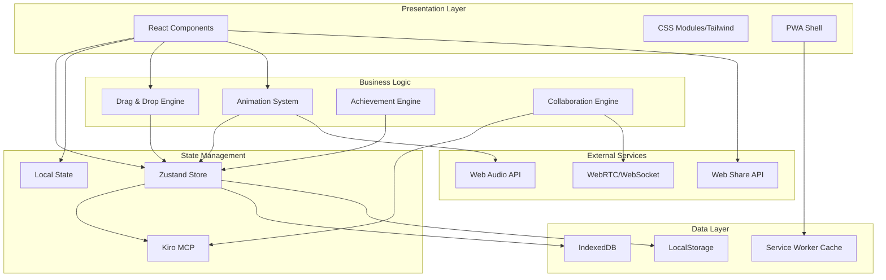

# Design Document - Altar Builder Mictlán

## Overview

Altar Builder Mictlán is a Progressive Web Application that enables users to create virtual Day of the Dead altars through an intuitive drag-and-drop interface. The application follows a progressive enhancement approach with three distinct levels of complexity, each building upon the previous one. The architecture emphasizes performance, accessibility, and cultural authenticity while leveraging modern web technologies.

## Architecture

### High-Level Architecture



### Progressive Enhancement Levels

1. **Level 1 (Ofrenda)**: Core functionality with basic drag-and-drop, offline support, and local persistence
2. **Level 2 (Catrina)**: Enhanced interactivity with animations, achievements, audio, and advanced persistence
3. **Level 3 (Mictlán)**: Full Kiro integration with collaborative editing, steering behaviors, and advanced features

## Components and Interfaces

### Core Components

#### 1. Grid Workspace Component
```typescript
interface GridWorkspaceProps {
  dimensions: { rows: number; cols: number };
  elements: PlacedElement[];
  onElementPlace: (element: OfrendarElement, position: GridPosition) => void;
  onElementRemove: (elementId: string) => void;
  isCollaborative?: boolean;
}

interface GridPosition {
  row: number;
  col: number;
}

interface PlacedElement {
  id: string;
  elementType: ElementType;
  position: GridPosition;
  layer?: number;
  animations?: AnimationConfig[];
}
```

#### 2. Element Panel Component
```typescript
interface ElementPanelProps {
  elements: OfrendarElement[];
  categories: ElementCategory[];
  selectedCategory?: string;
  onCategorySelect: (category: string) => void;
  onElementDrag: (element: OfrendarElement) => void;
}

interface OfrendarElement {
  id: string;
  name: string;
  type: ElementType;
  category: ElementCategory;
  icon: string;
  maxQuantity: number;
  placementRules: PlacementRule[];
  animations?: AnimationDefinition[];
  soundEffect?: string;
}
```

#### 3. Drag and Drop System
```typescript
interface DragDropEngine {
  startDrag(element: OfrendarElement, sourcePosition?: GridPosition): void;
  updateDrag(position: { x: number; y: number }): void;
  endDrag(targetPosition?: GridPosition): boolean;
  validateDrop(element: OfrendarElement, position: GridPosition): ValidationResult;
}

interface ValidationResult {
  isValid: boolean;
  reason?: string;
  suggestions?: GridPosition[];
}
```

#### 4. Animation System
```typescript
interface AnimationEngine {
  registerAnimation(elementId: string, animation: AnimationConfig): void;
  startAnimation(elementId: string, animationType: AnimationType): void;
  stopAnimation(elementId: string): void;
  pauseAllAnimations(): void;
  resumeAllAnimations(): void;
}

interface AnimationConfig {
  type: AnimationType;
  duration: number;
  easing: string;
  loop: boolean;
  performance: PerformanceLevel;
}
```

### State Management Architecture

#### Zustand Store Structure
```typescript
interface AltarBuilderState {
  // Grid and Elements
  grid: {
    dimensions: GridDimensions;
    placedElements: Map<string, PlacedElement>;
  };
  
  // Available Elements
  elements: {
    available: OfrendarElement[];
    categories: ElementCategory[];
    selectedCategory?: string;
  };
  
  // UI State
  ui: {
    isDragging: boolean;
    dragPreview?: DragPreview;
    selectedElement?: string;
    showAchievements: boolean;
    isOffline: boolean;
  };
  
  // Settings
  settings: {
    animationsEnabled: boolean;
    audioEnabled: boolean;
    volume: number;
    theme: 'light' | 'dark' | 'auto';
  };
  
  // Achievements
  achievements: {
    unlocked: Achievement[];
    progress: Map<string, number>;
  };
  
  // Collaboration (Level 3)
  collaboration?: {
    roomId?: string;
    peers: CollaborationPeer[];
    cursors: Map<string, CursorPosition>;
  };
}
```

#### Kiro MCP Integration (Level 3)
```typescript
interface KiroMCPModules {
  altar: {
    actions: ['placeElement', 'removeElement', 'clearAltar', 'validateComposition'];
    state: AltarState;
  };
  
  user: {
    actions: ['updateSettings', 'unlockAchievement', 'saveProgress'];
    state: UserState;
  };
  
  collaboration: {
    actions: ['joinRoom', 'leaveRoom', 'syncState', 'broadcastCursor'];
    state: CollaborationState;
  };
  
  steering: {
    actions: ['spawnMariposa', 'updateBehavior', 'optimizePerformance'];
    state: SteeringState;
  };
}
```

## Data Models

### Core Data Models

#### Element Type System
```typescript
enum ElementType {
  VELA = 'vela',
  FLOR = 'flor',
  FOTO = 'foto',
  RETRATO_PRINCIPAL = 'retrato_principal',
  PAN_DE_MUERTO = 'pan_de_muerto',
  PAPEL_PICADO = 'papel_picado',
  CALAVERA = 'calavera',
  INCIENSO = 'incienso',
  AGUA = 'agua',
  SAL = 'sal',
  COMIDA = 'comida',
  BEBIDA = 'bebida',
  JUGUETE = 'juguete',
  LIBRO = 'libro',
  CRUZ = 'cruz'
}

enum ElementCategory {
  ESENCIALES = 'esenciales',
  DECORATIVOS = 'decorativos',
  OFRENDAS = 'ofrendas',
  PERSONALES = 'personales'
}
```

#### Placement Rules
```typescript
interface PlacementRule {
  type: 'maxQuantity' | 'rowRestriction' | 'columnRestriction' | 'proximity' | 'stacking';
  value: number | string | GridPosition[];
  message: string;
}

interface CompositionRule {
  name: string;
  description: string;
  validator: (altar: PlacedElement[]) => boolean;
  scoreMultiplier: number;
}
```

#### Achievement System
```typescript
interface Achievement {
  id: string;
  name: string;
  description: string;
  icon: string;
  condition: AchievementCondition;
  reward?: AchievementReward;
  unlocked: boolean;
  unlockedAt?: Date;
}

interface AchievementCondition {
  type: 'elementCount' | 'altarCount' | 'composition' | 'time' | 'collaboration';
  target: number | string;
  current: number;
}
```

### Persistence Models

#### Altar Save Format
```typescript
interface SavedAltar {
  id: string;
  name: string;
  createdAt: Date;
  updatedAt: Date;
  thumbnail: string; // Base64 encoded image
  elements: PlacedElement[];
  metadata: {
    score: number;
    completionLevel: number;
    culturalAuthenticity: number;
    collaborators?: string[];
  };
  version: string;
}
```

#### IndexedDB Schema
```typescript
interface AltarBuilderDB {
  altars: SavedAltar[];
  achievements: Achievement[];
  settings: UserSettings;
  analytics: UsageAnalytics[];
}
```

## Error Handling

### Error Categories and Strategies

#### 1. Drag and Drop Errors
- **Invalid Placement**: Show visual feedback with red border and tooltip
- **Quota Exceeded**: Display modal with element limits and suggestions
- **Performance Issues**: Automatically reduce animation complexity

#### 2. Persistence Errors
- **LocalStorage Full**: Prompt user to clear old data or export altars
- **IndexedDB Unavailable**: Fallback to LocalStorage with reduced functionality
- **Sync Conflicts**: Use last-write-wins with user notification

#### 3. Collaboration Errors
- **Connection Failed**: Show retry button and fallback to offline mode
- **Peer Disconnected**: Maintain state for 5 minutes with reconnection attempts
- **State Desync**: Implement operational transformation for conflict resolution

#### 4. Performance Errors
- **Low FPS**: Automatically reduce animation count and complexity
- **Memory Pressure**: Trigger garbage collection and asset cleanup
- **Audio Issues**: Gracefully degrade to visual-only feedback

### Error Recovery Mechanisms

```typescript
interface ErrorHandler {
  handleDragError(error: DragError): void;
  handlePersistenceError(error: PersistenceError): void;
  handleCollaborationError(error: CollaborationError): void;
  handlePerformanceError(error: PerformanceError): void;
}

interface ErrorRecovery {
  retry: (maxAttempts: number) => Promise<void>;
  fallback: (alternativeAction: () => void) => void;
  notify: (message: string, severity: 'info' | 'warning' | 'error') => void;
}
```

## Testing Strategy

### Testing Pyramid

#### 1. Unit Tests (70%)
- **Component Logic**: React component behavior and props handling
- **State Management**: Zustand store actions and state transitions
- **Business Logic**: Placement rules, composition validation, achievement conditions
- **Utilities**: Animation helpers, persistence utilities, validation functions

#### 2. Integration Tests (20%)
- **Drag and Drop Flow**: Complete user interaction from drag start to element placement
- **Persistence Integration**: Save/load cycles with LocalStorage and IndexedDB
- **Animation System**: Element animations and performance optimization
- **Achievement System**: Unlock conditions and progress tracking

#### 3. End-to-End Tests (10%)
- **Complete User Journeys**: Building a complete altar from start to finish
- **Cross-Browser Compatibility**: Core functionality across supported browsers
- **PWA Features**: Offline functionality and service worker behavior
- **Collaboration Flow**: Real-time editing with multiple users (Level 3)

### Testing Tools and Frameworks

```typescript
// Test Configuration
interface TestConfig {
  unit: {
    framework: 'Vitest';
    coverage: 'c8';
    mocking: '@testing-library/jest-dom';
  };
  
  integration: {
    framework: 'Playwright';
    browsers: ['chromium', 'firefox', 'webkit'];
  };
  
  e2e: {
    framework: 'Cypress';
    environments: ['development', 'staging'];
  };
}
```

### Performance Testing

#### Metrics and Benchmarks
- **First Contentful Paint**: < 1.5s
- **Largest Contentful Paint**: < 2.5s
- **Cumulative Layout Shift**: < 0.1
- **First Input Delay**: < 100ms
- **Frame Rate**: 60fps (desktop), 30fps (mobile)
- **Memory Usage**: < 100MB peak
- **Bundle Size**: < 500KB (with code splitting)

#### Performance Monitoring
```typescript
interface PerformanceMonitor {
  trackFPS(): void;
  trackMemoryUsage(): void;
  trackBundleSize(): void;
  trackUserInteractions(): void;
  generateReport(): PerformanceReport;
}
```

## Security Considerations

### Data Protection
- **Local Storage Encryption**: Sensitive user data encrypted before storage
- **Secure Room IDs**: Cryptographically secure random generation for collaboration
- **Input Sanitization**: All user inputs sanitized to prevent XSS attacks
- **CSP Headers**: Content Security Policy to prevent code injection

### Collaboration Security
- **Room Access Control**: Time-limited room URLs with expiration
- **Peer Validation**: Verify peer identity before establishing connections
- **Data Validation**: Validate all incoming collaboration data
- **Rate Limiting**: Prevent spam and abuse in collaborative sessions

### Privacy
- **No Personal Data Collection**: Application works entirely offline-first
- **Anonymous Analytics**: Optional usage analytics without personal identifiers
- **Local-Only Storage**: All user data remains on device unless explicitly shared

## Accessibility Implementation

### WCAG 2.1 AA Compliance

#### Keyboard Navigation
```typescript
interface KeyboardNavigation {
  gridNavigation: {
    arrows: 'Move focus between grid cells';
    enter: 'Select/place element';
    escape: 'Cancel current action';
    tab: 'Navigate between UI sections';
  };
  
  shortcuts: {
    'Ctrl+Z': 'Undo last action';
    'Ctrl+Y': 'Redo last action';
    'Ctrl+S': 'Save altar';
    'Ctrl+N': 'New altar';
  };
}
```

#### Screen Reader Support
- **ARIA Labels**: Comprehensive labeling for all interactive elements
- **Live Regions**: Announce state changes and user actions
- **Semantic HTML**: Proper heading hierarchy and landmark roles
- **Focus Management**: Logical focus order and visible focus indicators

#### Visual Accessibility
- **High Contrast Mode**: Alternative color schemes for better visibility
- **Reduced Motion**: Respect user's motion preferences
- **Scalable Text**: Support for 200% zoom without horizontal scrolling
- **Color Independence**: Information not conveyed by color alone

## Performance Optimization

### Bundle Optimization
- **Code Splitting**: Lazy load Level 2 and Level 3 features
- **Tree Shaking**: Remove unused code from final bundle
- **Asset Optimization**: Compress images and optimize SVG icons
- **Service Worker Caching**: Aggressive caching strategy for static assets

### Runtime Performance
- **Virtual Scrolling**: For large element collections
- **Animation Pooling**: Reuse animation instances to reduce memory
- **Debounced Persistence**: Batch save operations to reduce I/O
- **Efficient Rendering**: React.memo and useMemo for expensive computations

### Memory Management
```typescript
interface MemoryManager {
  trackAllocations(): void;
  cleanupUnusedAssets(): void;
  optimizeAnimations(): void;
  garbageCollect(): void;
}
```

## Browser Compatibility Strategy

### Progressive Enhancement
- **Core Features**: Work on all modern browsers (Chrome 90+, Safari 14+, Firefox 88+, Edge 90+)
- **Enhanced Features**: Graceful degradation for unsupported APIs
- **Polyfills**: Minimal polyfills for critical missing features
- **Feature Detection**: Runtime detection of browser capabilities

### API Fallbacks
```typescript
interface APIFallbacks {
  webShare: 'Copy to clipboard + modal';
  webRTC: 'WebSocket relay server';
  indexedDB: 'LocalStorage with reduced capacity';
  serviceWorker: 'Cache API with manual refresh';
}
```

This design provides a solid foundation for implementing the Altar Builder Mictlán application with clear separation of concerns, progressive enhancement, and robust error handling while maintaining cultural authenticity and accessibility standards.